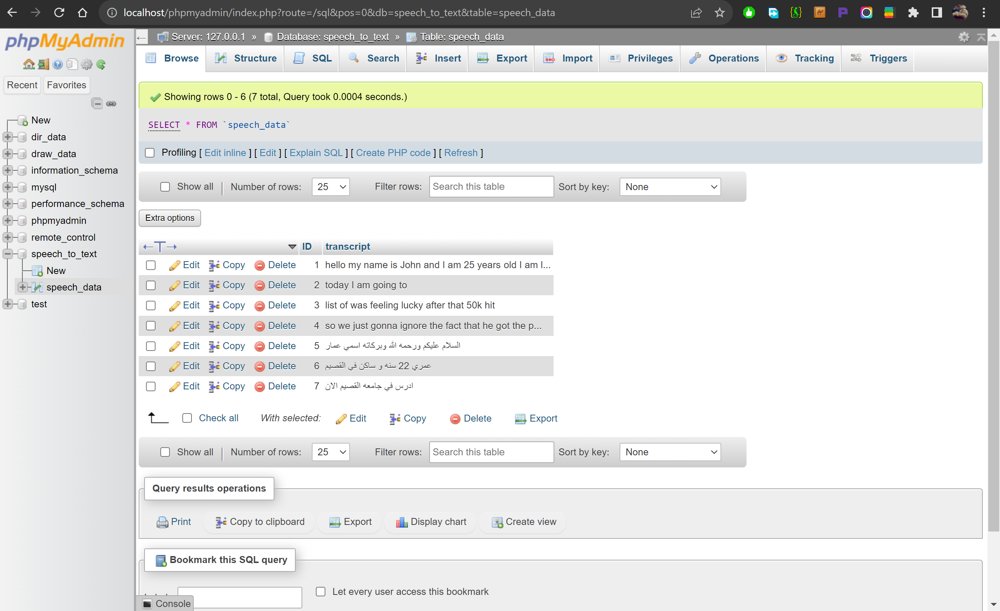

# SpeechToText
HTML page that detects speech and turn it into text infinitely.

## speech_to_text.html
In this file, it detect any words spoken and turn it into text in an infinite loop, it will ask you to access microphone to use it without errors.

## insert_speech_data.php
The speech_to_text.html code sends the transcript recognized to insert_speech_data.php file to connect to database and insert the transcript into the table(speech_data). As shown in the picture below:

## Note: 
All the functions in the codes have explaining comments for you to understand easily.
